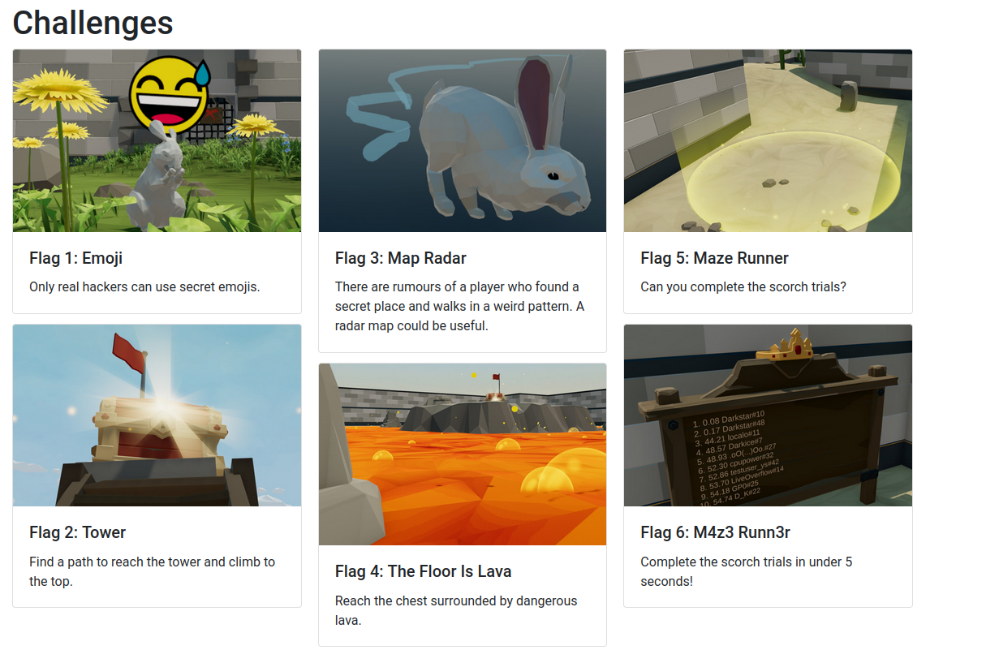

# Maze

A game intended to be hacked. This game was originally developed by [LiveOverflow](https://liveoverflow.com/) as part of the CSCG (Cyber Security Challenge Germany) 2020.



## Maze Server

An experimental server for the "Maze" game, developy by [pluxtore](https://github.com/pluxtore/maze-server)

### Features

- [x] Basic functionality of the game such as moving around and showing emojis
- [x] Multiplayer support for the features above
- [x] Unlocking of emojis and places
- [x] Fur colors
- [x] Teleporting to places
- [x] "Anti Cheat" for passing through walls
- [x] "Anti Cheat" for speed hax
- [x] Dying due to lava
- [x] Race support
- [x] Flags
- [x] White Rabbit Bot
- [x] Highscore board
- [ ] Proper Anti-DDos


## Instructions for running locally

### Masterserver

```bash
cd maze_masterserver
./run.sh
```

### Gameserver

```bash
cd maze_gameserver
./run.sh
```

### Game client

Depending on your OS, read the corresponding file in the [maze_client/](maze_client) directory. Once you have followed the instructions, simply launch the client.
